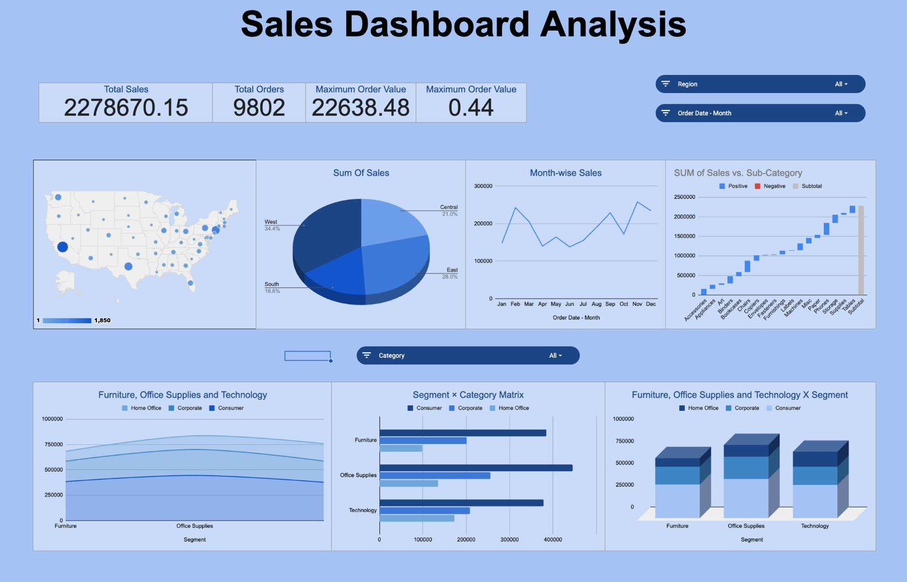

<div align="center">

# 📊 Retail Profitability & Margin Optimization Dashboard

**Section C — Group 10 | Capstone Project**

_An end-to-end data analytics project that transforms raw retail sales data into actionable profitability insights through data cleaning, pivot-table analysis, and interactive dashboard visualization._

---

</div>

## Table of Contents

- [Overview](#overview)
- [Key Objectives](#key-objectives)
- [Repository Structure](#repository-structure)
- [Dataset Description](#dataset-description)
- [Data Cleaning & Preprocessing](#data-cleaning--preprocessing)
- [Analysis & Calculations](#analysis--calculations)
- [Dashboard](#dashboard)
- [Documentation](#documentation)
- [Getting Started](#getting-started)
- [Tools & Technologies](#tools--technologies)
- [Contributors](#contributors)
- [License](#license)

---

## Overview

This project analyzes a retail sales dataset of **~9,800 transactions** across the United States to uncover patterns in profitability, regional performance, category-level margins, and shipping efficiency. The final deliverable is an interactive Excel-based dashboard that empowers business stakeholders to make data-driven decisions for margin optimization.

---

## Key Objectives

| # | Objective |
|---|-----------|
| 1 | Clean and standardize raw transactional data for reliable analysis |
| 2 | Compute derived metrics — Order Year, Order Month, and Shipping Days |
| 3 | Build pivot-table summaries by **Category**, **Region**, **Sub-Category**, **Ship Mode**, **State**, and **Segment** |
| 4 | Design a visual dashboard highlighting sales distribution, regional trends, and category performance |
| 5 | Deliver actionable recommendations for profitability improvement |

---

## Repository Structure

```
├── Raw Dataset1/
│   └── Dataset_Capstone.csv            # Original raw dataset (9,800 rows × 18 columns)
│
├── Cleaned Dataset/
│   ├── Capstone-clean-dataset.csv      # Cleaned dataset (9,801 rows × 21 columns)
│   └── CleanedDataset.md              # Data-cleaning documentation & methodology
│
├── Calculation and PIvot Table/
│   └── Dataset Capstone Calculation.csv  # Pivot-table summaries & aggregated calculations
│
├── Dashboard/
│   ├── Capstone.xlsx                   # Interactive Excel dashboard workbook
│   └── Dashboard.jpeg                  # Dashboard screenshot / preview
│
├── Documentation/
│   └── Retail Sales Performance & Operational Efficiency Analysis.pdf
│                                       # Detailed project report
│
├── Presentation/
│   └── (presentation materials)
│
└── README.md                           # ← You are here
```

---

## Dataset Description

### Raw Dataset — `Dataset_Capstone.csv`

| Column | Description |
|--------|-------------|
| Row ID | Unique row identifier |
| Order ID | Unique order identifier |
| Order Date | Date the order was placed |
| Ship Date | Date the order was shipped |
| Ship Mode | Shipping method (Standard Class, Second Class, First Class, Same Day) |
| Customer ID | Unique customer identifier |
| Customer Name | Full name of the customer |
| Segment | Market segment (Consumer, Corporate, Home Office) |
| Country | Country of the transaction |
| City | City of the customer |
| State | State of the customer |
| Postal Code | Postal/ZIP code |
| Region | Geographic region (West, East, Central, South) |
| Product ID | Unique product identifier |
| Category | Product category (Furniture, Office Supplies, Technology) |
| Sub-Category | Product sub-category |
| Product Name | Full product name |
| Sales | Transaction sales amount (USD) |

### Cleaned Dataset — `Capstone-clean-dataset.csv`

The cleaned version retains all 18 original columns and adds **3 derived columns**:

| New Column | Description |
|------------|-------------|
| Order Year | Year extracted from Order Date |
| Order Month | Month extracted from Order Date |
| Shipping Days | Difference in days between Ship Date and Order Date |

---

## Data Cleaning & Preprocessing

A comprehensive cleaning pipeline was applied to the raw data using **Google Sheets** formulas (`ARRAYFORMULA`) for reproducibility:

1. **Missing-Value Imputation** — Each column received a domain-appropriate default (e.g., median for Postal Code, average for Sales, "Standard Class" for Ship Mode).
2. **Text Standardization** — Extra whitespace trimmed; names and locations converted to proper case.
3. **Date Normalization** — Numeric serial dates and inconsistent text dates converted to a uniform date format.
4. **Derived Feature Engineering** — Order Year, Order Month, and Shipping Days computed for downstream analysis.

> Full details are documented in [`Cleaned Dataset/CleanedDataset.md`](Cleaned%20Dataset/CleanedDataset.md).

---

## Analysis & Calculations

Pivot-table analyses were performed across multiple dimensions:

| Dimension | Metric(s) |
|-----------|-----------|
| **Category** (Furniture, Office Supplies, Technology) | SUM of Sales |
| **Region** (Central, East, South, West) | SUM of Sales |
| **Month** (Jan – Dec) | SUM of Sales (trend) |
| **Segment** (Consumer, Corporate, Home Office) | SUM of Sales by Category |
| **Sub-Category** | SUM of Sales |
| **Ship Mode** | SUM of Sales |
| **State** | COUNT of Orders, SUM of Sales |

These summaries feed directly into the dashboard visualizations.

---

## Dashboard

The interactive dashboard is built in **Microsoft Excel** and saved as [`Dashboard/Capstone.xlsx`](Dashboard/Capstone.xlsx).

<div align="center">

### Dashboard Preview



</div>

**Highlights:**
- Sales breakdown by **Category** and **Sub-Category**
- Regional sales distribution across the United States
- Monthly sales trends for seasonality analysis
- Segment-wise performance comparison
- Shipping mode efficiency overview
- State-level order count and revenue mapping

---

## Documentation

A detailed project report covering methodology, findings, and business recommendations is available at:

> [`Documentation/Retail Sales Performance & Operational Efficiency Analysis.pdf`](Documentation/Retail%20Sales%20Performance%20%26%20Operational%20Efficiency%20Analysis%20(1).pdf)

> [`Direct Report Link`](https://docs.google.com/document/d/1irLA_jXtsgEpZnzh0xRmhwhzpkpY8BP_tJ3v2AU9rkk/edit?usp=sharing)

---

## Getting Started

1. **Clone the repository**
   ```bash
   git clone https://github.com/A1B2C3D4E5F6G7H8I9J0164-hack/SectionC_Group10_Retail-Profitability-Margin-Optimization-Dashboard.git
   cd SectionC_Group10_Retail-Profitability-Margin-Optimization-Dashboard
   ```

2. **Explore the data**
   - Open `Raw Dataset1/Dataset_Capstone.csv` to view the original data.
   - Open `Cleaned Dataset/Capstone-clean-dataset.csv` for the processed version.

3. **View the dashboard**
   - Open `Dashboard/Capstone.xlsx` in Microsoft Excel (desktop recommended for full interactivity).

4. **Read the report**
   - Open the PDF in `Documentation/` for the full analysis write-up.

---

## Tools & Technologies

| Tool | Purpose |
|------|---------|
| **Google Sheets** | Data cleaning, formula-based preprocessing |
| **Microsoft Excel** | Pivot tables, calculations, dashboard creation |
| **CSV** | Data interchange format |
| **Git & GitHub** | Version control and collaboration |

---

## Contributors

| Name | Section |
|------|---------|
| Group 10 Members | Section C |
| 1. Viraj Chafale | Section C |
| 2. Aryan Patel | Section C |
| 3. Aditya Rana | Section C |
| 4. Augustya Purohit | Section C |
| 5. Gogulamudi Jayadeep | Section C |


---

## License

This project is part of an academic capstone exercise. All data and materials are intended for **educational purposes only**.

---

<div align="center">

_Built with 📈 data and ☕ determination._

</div>